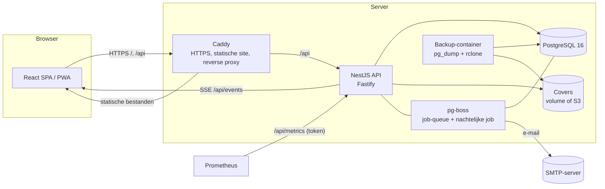

# Architectuur

BiblioApp is een monorepo (pnpm workspaces) met een NestJS-API, een React-frontend en een PostgreSQL-database.

## Onderdelen

| Map                   | Doel                                                                                 |
| --------------------- | ------------------------------------------------------------------------------------ |
| `apps/api`            | NestJS (Fastify) API, Prisma-schema en -migraties, seed, belastingtest (`load/`)     |
| `apps/web`            | React + Vite SPA, PWA (manifest, service worker), Playwright e2e-, PWA- en axe-tests |
| `packages/shared`     | Gedeelde constanten/types                                                            |
| `packages/api-client` | Typed client, gegenereerd uit de OpenAPI-spec van de API                             |
| `deploy/`             | Dockerfiles, productie-compose, Caddyfile, backup- en monitoringconfig               |
| `docs/`               | Dit document, beheerhandleiding, toegankelijkheid, load-test                         |

## Domeinmodel (Prisma)

- **Catalogus**: `Book`, `Author`, `BookAuthor`, `Genre`, `Tag`/`BookTag`, `Series`, `Copy` (fysiek exemplaar met barcode en status).
  Beschikbaarheid is altijd _afgeleid_ uit de exemplaren; er zijn geen opgeslagen tellers.
- **Gebruikers**: `User` (rol `MEMBER`/`LIBRARIAN`/`ADMIN`, 2FA, taal), `Member` (lidnummer, lidmaatschap, blokkade), `Session`, `EmailToken`, `RecoveryCode`, `AuditLog`.
- **Uitleen**: `Loan`, `Fine`, `Payment`, `OnlinePayment`, `Setting` (termijnen, limieten, tarieven, bewaartermijnen).
- **Reserveringen en meldingen**: `Reservation` (wachtrij), `Notification`, `EmailTemplate`.
- **Community**: `Review` (met moderatie), `WishlistItem`, `Suggestion`.

Belangrijke integriteitsregels staan **in de database** (partiële unieke indexen), niet alleen in code:
`Loan_copyId_active_key` (één actieve uitleen per exemplaar), `Reservation_active_key` (één actieve reservering per lid per boek),
`Reservation_ready_copy_key` (een klaargelegd exemplaar hoort bij één reservering), `Fine_overdue_per_loan_key`,
plus CHECK-constraints op bedragen en sterren. Zoekindexen: GIN full-text (`Book_fts_idx`) en trigram (`Book_title_trgm_idx`, `Author_name_trgm_idx`).

## Beveiliging

- **Authenticatie**: zelfgebouwd; argon2id, sessies in Postgres (httpOnly-, SameSite=Lax-, `Secure`-cookie), CSRF-token per sessie,
  rate limiting op inloggen/registreren, e-mailverificatie, wachtwoord-reset, optionele TOTP-2FA met herstelcodes.
- **Autorisatie**: een globale guard; routes zijn standaard beschermd, publiek is expliciet (`@Public()`), rollen via `@Roles()`.
- **Transport/headers**: Caddy zet HTTPS en HSTS, CSP, X-Frame-Options, enz.; de API zet daarnaast zelf headers (helmet) en past een algemene rate limit toe.
- **Configuratie**: de API weigert in productie te starten met ontbrekende of onveilige configuratie (`validateEnv`).
- **Geheimen**: alleen in de omgeving (server-`.env`, `chmod 600`; CI via GitHub-secrets). Logs wissen cookies, tokens en wachtwoorden.
- **Afhankelijkheden**: `pnpm audit --prod` in CI, Dependabot wekelijks.

## Concurrency

Uitlenen, innemen, reserveren en de wachtrij draaien in één transactie met rij-locks (`SELECT … FOR UPDATE`, `SKIP LOCKED`) op exemplaar,
lid en boek; zie de tests met parallelle verzoeken en de belastingtest (`docs/load-test.md`).

## Achtergrondwerk

- **pg-boss** (schema `pgboss` in dezelfde database): e-mail verzenden met retries, en elke nacht om 03:00 de onderhoudsjob:
  herinneringen, aanmaningen en boetes, verlopen reserveringen, lidmaatschapscontrole, **bewaartermijnen en anonimisering (AVG)**.
- **Realtime**: Server-Sent Events (`/api/events`) voor beschikbaarheid en meldingen.

## Observeerbaarheid

- Gestructureerde JSON-logs (pino) met request-id (`X-Request-Id`).
- `GET /api/health` (liveness), `GET /api/health/ready` (database, migraties, job-queue; voor Docker/load balancer).
- `GET /api/metrics` (Prometheus, Bearer-token): HTTP-latency/-fouten, procesmetrics en bedrijfsmetrics (actieve/te late uitleningen,
  wachtrij, onverzonden e-mails). Alertregels in `deploy/monitoring/alerts.yml`.

## Kwaliteitsbewaking (CI)

Lint, format, typecheck, unit-/integratietests (API tegen een echte Postgres), e2e (Playwright, ook axe-toegankelijkheid), PWA-test,
productie-rooktest, back-up/herstel-test, Docker-builds en dependency-audit; zie `.github/workflows/ci.yml`.
